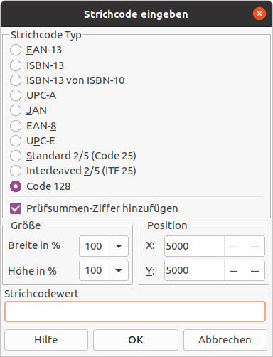

# LibreOffice Barcode Extension

## Description

Generates the following Barcode types in LibreOffice:
* EAN-13
* ISBN-13
* ISB-13 from ISBN-10
* UPC-A
* JAN
* EAN-8
* UPC-E
* Standard 2 of 5 (Code 25)
* Interleaved 2 of 5 (ITF 25)
* Code 128

## Install

Download the Extension from the [LibreOffice Extension Repository](https://extensions.libreoffice.org/en/extensions/show/1046)

Then install it in LibreOffice via *Tools→Extension Manager*.

## Usage

The extension works in LibreOffice Writer, Calc, Impress and Draw.

### Graphical

When installed, the extension adds the following menu entry: *Insert→Object→Barcode*

Insert the Barcode by using the dialog:



### API

You can insert Barcodes by using LibreOffice Basic Macros (or any other language which as UNO bindings).

Use it like this:

```
Sub InsertBarcode
    Dim oJob as Object
    oJob = createUnoService("org.libreoffice.Barcode")

    Dim args(8) as new com.sun.star.beans.NamedValue
    args(0).Name = "Action"
    args(0).Value = "InsertBarcode"
    args(1).Name = "BarcodeType"
    args(1).Value = "CODE128"
    args(2).Name = "BarcodeValue"
    args(2).Value = "123456789"
    args(3).Name = "BarcodeAddChecksum"
    args(3).Value = True
    args(4).Name = "WidthScale"
    args(4).Value = "100"
    args(5).Name = "HeightScale"
    args(5).Value = "100"
    args(6).Name = "PositionX"
    args(6).Value = "1000"
    args(7).Name = "PositionY"
    args(7).Value = "1000"
    args(8).Name = "TargetComponent"
    args(8).Value = ThisComponent
    oJob.execute(args)
End Sub
```

#### Parameters

Only the first three parameters are required. For the others, the default value will be used, when omitted.

Parameter | Description | Possible values | Default value
--------- | ----------- | --------------- | -------------
`Action` | Which action to execute | `InsertBarcode` |
`BarcodeType` | Barcode type | `EAN13`, `ISBN13`, `Bookland`, `UPCA`, `JAN`, `EAN8`, `UPCE`, `STANDARD2OF5`, `INTERLEAVED2OF5`, `CODE128` |
`BarcodeValue` | The actual content of the barcode. | Different barcode types have different restrictions (e.g. numbers only) |
`BarcodeAddChecksum` | Whether a checksum should be automatically added. Ignored by some types. | `True`, `False` | `True`
`WidthScale` | Scale the barcode horizontally. Unit is percent. A value of 200 means the barcode width is doubled. | Integer (>0) | 100
`HeightScale` | Scale the barcode vertically. Unit is percent. A value of 200 means the barcode height is doubled. | Integer (>0) | 100
`PositionX` | Where the barcode is placed on the document canvas (X axis). Unit is 1/100th mm. A value of 1000 means 1cm. | Integer | 5000
`PositionY` | Where the barcode is placed on the document canvas (Y axis). Unit is 1/100th mm. A value of 1000 means 1cm. | Integer | 5000
`TargetComponent` | Which XComponent will be used to insert the Barcode. In Basic IDE, `ThisComponent` needs to be provided for the script to work from Basic IDE. | [XComponent](https://api.libreoffice.org/docs/idl/ref/interfacecom_1_1sun_1_1star_1_1lang_1_1XComponent.html) | The current component, as returned by [XDesktop::getCurrentComponent](https://api.libreoffice.org/docs/idl/ref/interfacecom_1_1sun_1_1star_1_1frame_1_1XDesktop.html#a53f8ac7d73776934812a666684915908)

## Development

1. Install [LibreOffice](http://www.libreoffice.org/download) & the [LibreOffice SDK](http://www.libreoffice.org/download)
2. Install [Eclipse](http://www.eclipse.org/) IDE for Java Developers & the [LOEclipse plugin](https://marketplace.eclipse.org/content/loeclipse)
3. Clone this repo to your disk
4. Import the project in Eclipse (File->Import->Existing Projects into Workspace)
5. Let Eclipse know the paths to LibreOffice & the SDK (Project->Properties->LibreOffice Properties)
6. Setup Run Configuration
    * Go to Run->Run Configurations
    * Create a new run configuration of the type "LibreOffice Application"
    * Select the project
    * Run!
    * *Hint: Show the error log to view the output of the run configuration (Window->Show View->Error Log)*

The extension will be installed in LibreOffice (see Tools->Extension Manager)

## Original Credits

This extension was originally created with the EuroOffice Extension Creator (by MultiRacio Ltd.)

* Code: Daniel Darabos, Kalman Szalai
* Chinese translation: Jack Shen
* Danish translation: Leif Lodahl
* Dutch translation: Nouws Cor
* French translation: Sophie Gautier
* German translation: Jens Binfet
* Japanese translation: Takaya Kubota
* Russian translation: Basil Shubin
* Serbian translation: Goran Rakic

For recent credits, see https://github.com/LibreOffice/barcode/graphs/contributors
